<h1 align="center">Hi, I'm Nicolás 👋</h1>

  <strong>Software Engineer · Backend · Cloud & DevOps</strong>

  Building backend systems and cloud solutions with a focus on
  <strong>reliability, clean architecture and automation</strong>.

  <a href="https://www.linkedin.com/in/nicol%C3%A1s-alejandro-garc%C3%ADa-pasmi%C3%B1o-82765333b/">LinkedIn</a>
  ·
  <a href="mailto:nikolasg12000@gmail.com">Email</a>

---

## 🚀 What I Build

Backend systems, REST APIs and cloud-based applications.

My strongest areas are:

- ☕ Java · Spring Boot
- 🐍 Python · Django REST Framework
- ☁️ AWS · Cloud Infrastructure
- 🔄 CI/CD · GitHub Actions
- 🏗️ Clean Architecture · SOLID
- 🐳 Docker · Linux
- 🗄️ PostgreSQL · MySQL · MongoDB

---

## ⭐ Featured Work

### 🌎 ECOS — Early Warning & Observation System

An open-source platform focused on early detection of
vector-borne diseases using public health and mobility data.

**Focus:** Data · Backend · APIs · Python

→ [View project](https://github.com/Nicolas-12000/ECOS)

---

### 💳 Banco P2P

A financial platform focused on peer-to-peer banking operations,
designed around backend architecture, APIs and transactional flows.

**Focus:** Backend · APIs · Architecture · Security

→ [View project](https://github.com/dramirezdlp99/ejercicio-banco-p2p)

---

## 📈 Engineering Results

🚀 <strong>73%</strong> reduction in API response time  
&nbsp;&nbsp;•&nbsp;&nbsp;
⚡ CI/CD pipelines under <strong>3 minutes</strong>

---

## 🛠️ Tech Stack

---

## 📊 GitHub

  
  

---

## 🎯 Currently

Deepening my expertise in:

**Cloud Architecture · DevOps · DevSecOps · Distributed Systems**

I enjoy solving real engineering problems, automating repetitive work,
and building systems that are reliable beyond the development environment.

---

  <i>Build. Automate. Measure. Improve.</i>

